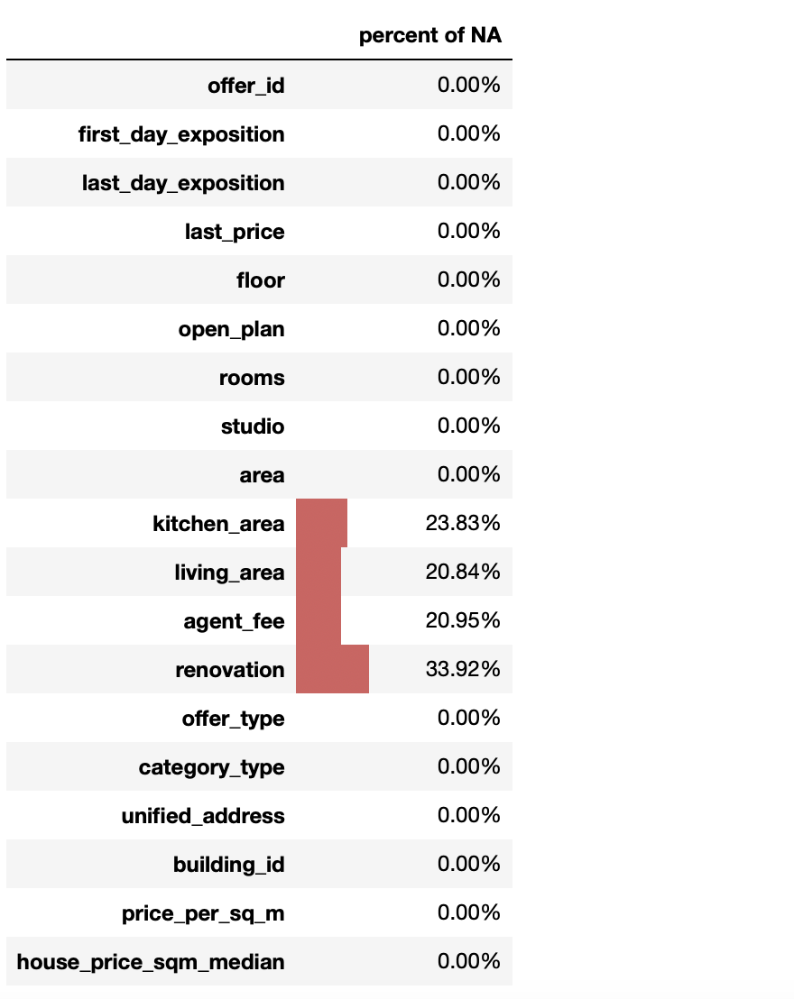
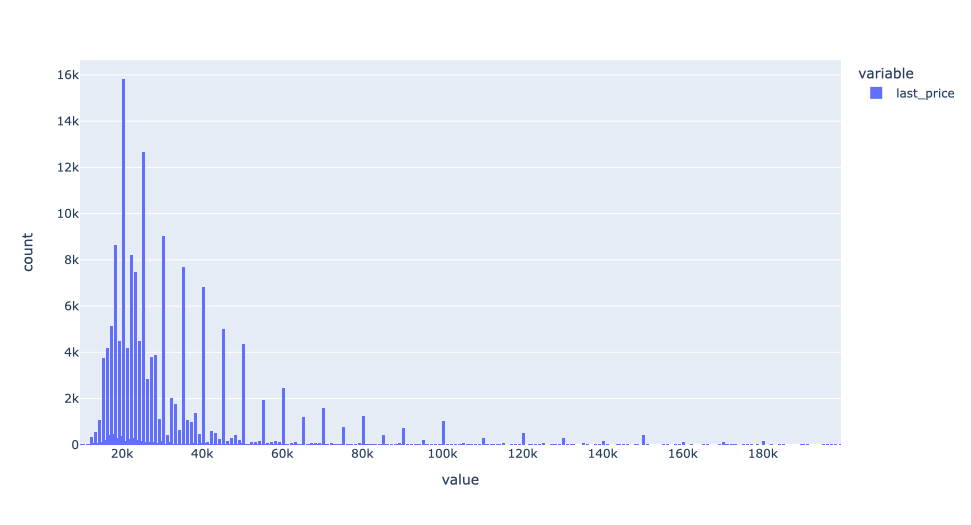
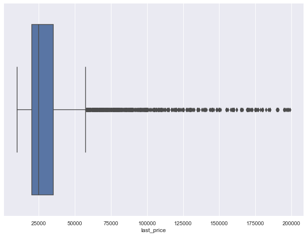
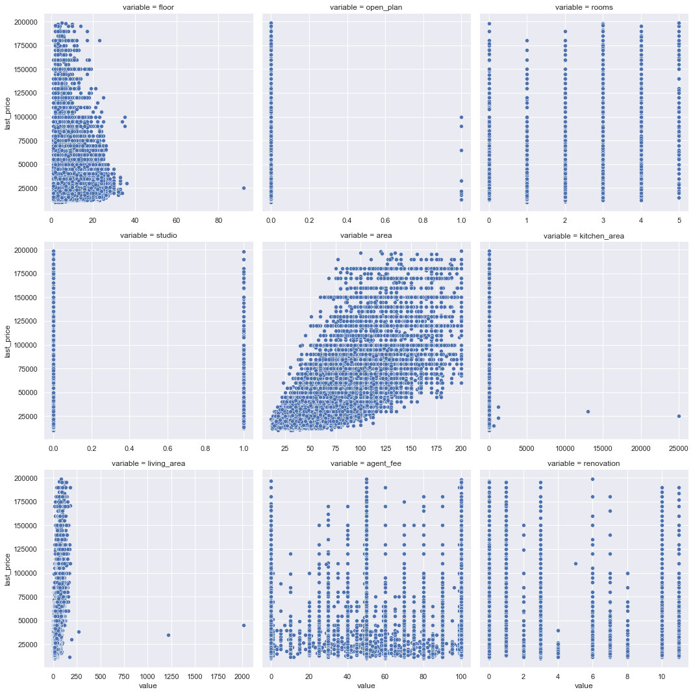
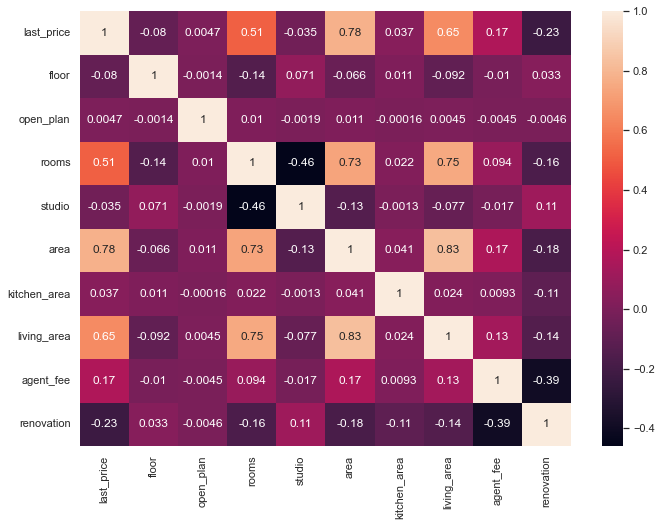

## E2E Sample ML project  

This file has the following structure:
1.  Information about source data and statistics
2.  Information about the model and chosen framework
3.  How to install instructions and run an app with virtual environment
4.  Information about Dockerfile and its content
5.  How to open the port in your remote VM
6.  How to run app using docker and which port it uses
 
### 1. Information about source data and statistics
**Datasource**: Data is derived from [Yandex.Realty](https://realty.yandex.ru) 
**Dataset description**: Real estate listings for apartments in St. Petersburg for rent from 2016 till the middle of August 2018

Firstly, we cleaned our data by deleting outliers from the original dataset. Our dataset is available in the file named **cleaned_dataset.tsv**. The code with exploratory data analysis (EDA) can be found in the file called **lab1_EDA_viz_BakaletsDaria**.

These are the variables from the dataset we used in our analysis (including newly generetated variables for data preprocessing purposes like price per squared meter):



We can notice that there are missing values for `living_area`, `kitchen_area`, `agent_fee` and `renovation`. What is more, some variables have wrong datatypes: e.g. variable `open_plan` should be transfomed from boolean to integer and `renovation` from float to integer. It has been done further in our analysis.

But before the proceed, let's have a look at some visualisation for acquiring a better understanding of the dataset.

#### Histogram of price
Here we can see that `last_price` is right-skewed which resembles a log-normal distribution. 




#### Boxplot of price
We cleaned the dataset from outliers at previous steps, but some of them are still present for the target variable. But the standatization will be applied later, so it is absolutely normal to have some of them left in our sample at the current stage.



#### Scatter plots
Let's construct pairplots to see more dependencies between variables `floor`, `open_plan`, `rooms`, `studio`, `area`, `kitchen_area`, `living_area`, `kitchen_area`, `agent_fee`, `renovation` and our target variable `last_price`. 



#### Heatmap
From the correlation matrix one can observe that not all of the variables have a strong relationship with the`last_price`: for instance, `studio` or `renovation`. However, we will not exclude all of them for the model building purpose.


     
 ```python
    <class 'pandas.core.frame.DataFrame'>
    RangeIndex: 155391 entries, 0 to 155390
    Data columns (total 11 columns):
     #   Column                Non-Null Count   Dtype  
    ---  ------                --------------   -----  
     0   first_day_exposition  155391 non-null  object 
     1   last_day_exposition   155391 non-null  object 
     2   last_price            155391 non-null  float64
     3   floor                 155391 non-null  int64  
     4   open_plan             155391 non-null  int64  
     5   rooms                 155391 non-null  int64  
     6   studio                155391 non-null  int64  
     7   area                  155391 non-null  float64
     8   agent_fee             122840 non-null  float64
     9   renovation            155391 non-null  int64  
     10  last_price_log        155391 non-null  int64
    dtypes: float64(4), int64(5), object(2)
    memory usage: 13.0+ MB
```
We can notice that there are still some nulls for `agent_fee`. We excluded this variable in our final model at all due to its poor explanatory meaning for renting apartments. However, we generated a new variable `offer_time` which shows us the time the offer was listed on the website:

```python
rent_df_cleaned['first_day_exposition'] = pd.to_datetime(rent_df_cleaned.first_day_exposition)
```
```python
rent_df_cleaned['last_day_exposition'] = pd.to_datetime(rent_df_cleaned.last_day_exposition)
```
```python
rent_df_cleaned['offer_time'] = (rent_df_cleaned['last_day_exposition'] - rent_df_cleaned['first_day_exposition']).dt.days
```

After that, we deleted the variables that we didn't need anymore.
Let's look at the sample from our resulting dataset:

```python
<div>
<style scoped>
    .dataframe tbody tr th:only-of-type {
        vertical-align: middle;
    }

    .dataframe tbody tr th {
        vertical-align: top;
    }

    .dataframe thead th {
        text-align: right;
    }
</style>
<table border="1" class="dataframe">
  <thead>
    <tr style="text-align: right;">
      <th></th>
      <th>first_day_exposition</th>
      <th>last_day_exposition</th>
      <th>last_price</th>
      <th>floor</th>
      <th>open_plan</th>
      <th>rooms</th>
      <th>studio</th>
      <th>area</th>
      <th>agent_fee</th>
      <th>renovation</th>
      <th>last_price_log</th>
      <th>offer_time</th>
    </tr>
  </thead>
  <tbody>
    <tr>
      <th>0</th>
      <td>2015-01-24 00:00:00+03:00</td>
      <td>2016-01-19 00:00:00+03:00</td>
      <td>20000.0</td>
      <td>7</td>
      <td>0</td>
      <td>1</td>
      <td>0</td>
      <td>28.0</td>
      <td>100.0</td>
      <td>3</td>
      <td>9.903488</td>
      <td>360</td>
    </tr>
    <tr>
      <th>1</th>
      <td>2015-11-17 00:00:00+03:00</td>
      <td>2016-03-04 00:00:00+03:00</td>
      <td>24000.0</td>
      <td>4</td>
      <td>0</td>
      <td>2</td>
      <td>0</td>
      <td>59.0</td>
      <td>100.0</td>
      <td>3</td>
      <td>10.085809</td>
      <td>108</td>
    </tr>
    <tr>
      <th>2</th>
      <td>2015-11-17 00:00:00+03:00</td>
      <td>2016-04-24 00:00:00+03:00</td>
      <td>18000.0</td>
      <td>6</td>
      <td>0</td>
      <td>1</td>
      <td>0</td>
      <td>36.0</td>
      <td>100.0</td>
      <td>3</td>
      <td>9.798127</td>
      <td>159</td>
    </tr>
    <tr>
      <th>3</th>
      <td>2016-02-04 00:00:00+03:00</td>
      <td>2016-02-28 00:00:00+03:00</td>
      <td>18000.0</td>
      <td>8</td>
      <td>0</td>
      <td>1</td>
      <td>0</td>
      <td>39.0</td>
      <td>90.0</td>
      <td>0</td>
      <td>9.798127</td>
      <td>24</td>
    </tr>
    <tr>
      <th>4</th>
      <td>2016-02-28 00:00:00+03:00</td>
      <td>2016-04-02 00:00:00+03:00</td>
      <td>19000.0</td>
      <td>3</td>
      <td>0</td>
      <td>1</td>
      <td>0</td>
      <td>36.0</td>
      <td>50.0</td>
      <td>11</td>
      <td>9.852194</td>
      <td>34</td>
    </tr>
  </tbody>
</table>
</div>
```
Later we break the dataset into train, validation, and holdout samples:

```python
    train_df = rent_df_cleaned[(rent_df_cleaned.first_day_exposition >= '2018-01-01') 
                              & (rent_df_cleaned.first_day_exposition < '2018-04-01')]

    test_df = rent_df_cleaned[(rent_df_cleaned.first_day_exposition >= '2018-04-01') 
                              & (rent_df_cleaned.first_day_exposition < '2018-06-01')]

    holdout_df = rent_df_cleaned[rent_df_cleaned.first_day_exposition >= '2018-06-01']
```
#### Step
No


